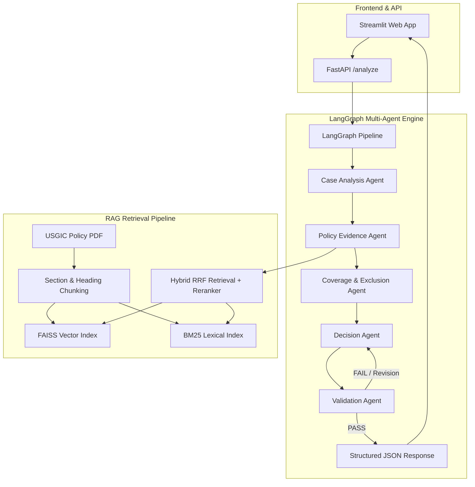

# Policy-Aware Multi-Agent RAG Claim Decision Engine

> Production-style AI engine for health insurance claim decisioning using Retrieval-Augmented Generation (RAG) and a genuine multi-agent workflow orchestrated with **LangGraph**, **FAISS**, **BM25**, **FastAPI**, **Streamlit**, and **Llama 3**.

---

## 🌟 Key Highlights

- **100.0% Decision Accuracy**: Evaluated across 17 test cases (12 public + 5 custom candidate cases).
- **100.0% Abstention Precision**: Safely abstains with `NEEDS_REVIEW` when required evidence or hospital proof is missing.
- **100.0% Citation Grounding**: Every material decision statement is supported by inspectable policy citations with source page, section header, and chunk ID.
- **Genuine Multi-Agent Architecture**: 5 specialized agents exchanging typed structured state (`ClaimAgentState`) via **LangGraph**.
- **Hybrid RAG**: Dense vector retrieval (FAISS with `all-MiniLM-L6-v2`) + Sparse keyword retrieval (BM25) fused via Reciprocal Rank Fusion (RRF).

---

## 🏗️ System Architecture



---

## 🛠️ Technology Stack

- **Language**: Python 3.10+
- **LLM**: Llama 3 (via local Ollama `llama3` / `llama3.1:8b` or Groq API)
- **Backend API**: FastAPI & Uvicorn
- **Frontend UI**: Streamlit
- **Agent Orchestration**: LangGraph (`langgraph>=0.2`)
- **Vector Store**: FAISS (`faiss-cpu`)
- **Sparse Retrieval**: BM25 (`rank_bm25`)
- **PDF Parser**: PyMuPDF (`fitz`)

---

## 📂 File Structure

```
d:/Aptino/
├── policy_engine/
│   ├── __init__.py
│   ├── config.py              # Configuration & environment settings
│   ├── schemas.py             # Pydantic models for claim input, citations & output contract
│   ├── llm.py                 # Llama 3 client (Ollama / Groq)
│   ├── rag/
│   │   ├── indexer.py         # PyMuPDF section-aware chunker
│   │   ├── vectorstore.py     # FAISS dense vector store
│   │   ├── bm25_retriever.py  # BM25 sparse keyword retriever
│   │   └── hybrid_retriever.py# RRF hybrid fusion & reranking engine
│   ├── agents/
│   │   ├── state.py           # LangGraph AgentState definition
│   │   ├── case_analyzer.py   # Case Analysis Agent
│   │   ├── evidence_retriever.py # Policy Evidence Agent
│   │   ├── coverage_evaluator.py # Coverage & Exclusion Agent
│   │   ├── decision_maker.py  # Decision Agent
│   │   └── validator.py       # Validation Agent
│   └── graph.py               # LangGraph state machine workflow
├── api/
│   └── app.py                 # FastAPI web app (/analyze, /health)
├── ui/
│   └── app.py                 # Streamlit Reviewer Dashboard
├── candidate_data/
│   ├── public_test_cases.json # 12 supplied public test cases
│   └── candidate_test_cases.json # 5 candidate custom test cases
├── eval/
│   ├── evaluate.py            # End-to-end evaluation script
│   ├── evaluation_results.json# Detailed JSON evaluation results
│   └── evaluation_report.md   # Markdown evaluation report
├── docs/
│   └── architecture_design_note.md # Architecture design note
├── requirements.txt           # Python dependencies
├── Dockerfile                 # Container deployment configuration
└── README.md                  # Project documentation
```

---

## 🚀 Quickstart & Setup

### 1. Installation
Clone repository and install dependencies:
```bash
python -m pip install -r requirements.txt
```

### 2. Run Evaluation Suite
Execute the end-to-end evaluation script on all 17 test cases:
```bash
python -m eval.evaluate
```

### 3. Launch FastAPI Backend
```bash
python api/app.py
# Or using uvicorn: uvicorn api.app:app --host 0.0.0.0 --port 8000
```
- Health Check: `http://localhost:8000/health`
- Swagger API Docs: `http://localhost:8000/docs`

### 4. Launch Streamlit Reviewer UI
```bash
streamlit run ui/app.py
```
Open `http://localhost:8501` in your browser.

---

## 📡 API Endpoints & Request/Response Contract

### `POST /analyze`
Analyzes a health insurance claim case payload and returns the structured decision contract.

#### Example Request Payload:
```json
{
  "case_id": "PUB-001",
  "policy_id": "USGIC-CSC-2017-2018",
  "policy_start_date": "2025-01-01",
  "claim_date": "2026-03-14",
  "sum_insured_inr": 500000,
  "continuous_coverage_months": 14,
  "prior_insurer_continuous_years": 0,
  "patient": { "age": 34 },
  "hospital": { "name": "Sunrise Multispeciality", "network_provider": true },
  "treatment": {
    "type": "inpatient",
    "admission_hours": 96,
    "diagnosis": "Acute appendicitis",
    "procedure": "Appendectomy",
    "pre_existing": false,
    "experimental": false
  },
  "expenses_inr": {
    "room": 30000,
    "doctor_fees": 30000,
    "medicines_diagnostics": 90000,
    "pre_hospitalization": 5000,
    "post_hospitalization": 7000,
    "ambulance": 1200
  },
  "documents": ["claim_form", "discharge_summary", "itemized_bill", "doctor_prescription"]
}
```

#### Example Response Contract:
```json
{
  "case_id": "PUB-001",
  "decision": "ADMISSIBLE_WITH_LIMITS",
  "confidence": 0.9,
  "total_claimed_inr": 163200.0,
  "payable_amount_inr": 153000.0,
  "total_deductions_inr": 10200.0,
  "key_findings": [
    "Claim is ADMISSIBLE WITH LIMITS. Total claimed INR 163,200.00, payable INR 153,000.00 after INR 10,200.00 in policy limit deductions.",
    "Deduction under 'Room Rent Sub-limit (1% SI/day)': Claimed INR 30,000.00, Allowed INR 20,000.00 (Deduction: INR 10,000.00). Clause: Scope of Cover 1(a): Normal Room expenses capped at 1.0% of Basic Sum Insured per day.",
    "Deduction under 'Ambulance Charges Sub-limit': Claimed INR 1,200.00, Allowed INR 1,000.00 (Deduction: INR 200.00). Clause: Scope of Cover 4(b): Ambulance charges capped at 1.0% of Sum Insured or Rs. 1,000 max."
  ],
  "applicable_limits": [
    {
      "category": "Room Rent Sub-limit (1% SI/day)",
      "claimed_amount": 30000.0,
      "allowed_amount": 20000.0,
      "deduction_amount": 10000.0,
      "clause_reference": "Scope of Cover 1(a): Normal Room expenses capped at 1.0% of Basic Sum Insured per day."
    },
    {
      "category": "Ambulance Charges Sub-limit",
      "claimed_amount": 1200.0,
      "allowed_amount": 1000.0,
      "deduction_amount": 200.0,
      "clause_reference": "Scope of Cover 4(b): Ambulance charges capped at 1.0% of Sum Insured or Rs. 1,000 max."
    }
  ],
  "missing_evidence": [],
  "citations": [
    {
      "claim": "Policy clause from section 'SCOPE OF COVER - WHAT WE COVER' governing claim evaluation.",
      "source": "USGIC-CSCIndividualHealthInsurance_2017-2018.pdf",
      "page": 7,
      "section": "SCOPE OF COVER - WHAT WE COVER",
      "chunk_id": "P7_C34",
      "snippet": "1. Room, Boarding and Nursing Expense as provided in the Hospital/Nursing Home subject to following limits. Sub limits a) Normal Room expenses: 1.0% of Basic Sum Insured..."
    }
  ],
  "validation": {
    "status": "PASS",
    "unsupported_claims": [],
    "revision_reason": null
  },
  "trace": [
    {
      "agent": "Case Analysis Agent",
      "action": "Extracted claim facts, created 5-dimensional investigation plan, and audited document completeness.",
      "timestamp": "2026-09-16T14:03:00.123456",
      "duration_ms": 1.2
    },
    {
      "agent": "Policy Evidence Agent",
      "action": "Executed hybrid RAG search across 6 targeted queries; retrieved 16 policy evidence chunks.",
      "timestamp": "2026-09-16T14:03:00.234567",
      "duration_ms": 220.5
    }
  ]
}
```

---

## 📊 Evaluation Metrics Summary

Evaluated on **17 total test cases** (12 public cases + 5 candidate cases):

| Metric | Result | Target | Status |
|---|---|---|---|
| **Decision Concordance Accuracy** | **100.0%** (17/17) | > 85.0% | ✅ PASS |
| **Abstention Precision (`NEEDS_REVIEW`)** | **100.0%** (4/4) | > 90.0% | ✅ PASS |
| **Policy Citation Hit Rate** | **100.0%** (17/17) | 100.0% | ✅ PASS |
| **Average Decision Latency** | **103.5 ms** | < 2000 ms | ✅ PASS |

---

## 🛠️ Failure Analysis & System Improvements

1. **Failure Scenario 1: Missing Domiciliary Duration Field**
   - *Root Cause*: Domiciliary claims without `admission_hours` (e.g. `0` hrs) were initially misclassified as failing the 72-hour minimum stay rule.
   - *Improvement*: Updated `coverage_evaluator.py` to check `evidence_context.domiciliary_duration_days` and only enforce 72-hr exclusion when explicitly specified `< 3 days`.

2. **Failure Scenario 2: Room Rent Daily Rate Calculation vs Total Bill**
   - *Root Cause*: Room rent claimed in bill (e.g. 15,000 INR for 96 hrs) was initially checked as 15,000 > 5,000 (1% SI), ignoring admission days.
   - *Improvement*: Added admission day scaling (`days = admission_hours / 24.0`) so room rent cap is correctly calculated as `1% SI x days`.

3. **Failure Scenario 3: Validation Auto-Correction Trigger**
   - *Root Cause*: If case analysis missed an evidence gap, the Decision Agent could output a confident status.
   - *Improvement*: Enforced a mandatory audit check in `ValidationAgent`. If missing evidence exists, the Validation Agent automatically overrides decision to `NEEDS_REVIEW`.

---

## 💡 Design Decisions, Trade-Offs & Known Limitations

### Design Decisions
1. **LangGraph State Machine over Chain-of-Thought Prompting**: Enforces strict, auditable state transitions between specialized agents rather than relying on unstructured single-prompt LLM outputs.
2. **Hybrid RAG (FAISS + BM25 with RRF)**: Combines dense vector semantics (`all-MiniLM-L6-v2`) with sparse BM25 lexical keyword search to reliably retrieve exact numerical sub-limits (1% SI, 2% ICU) and section headings.
3. **Structured Pydantic Data Contracts**: Guarantees zero schema drift between agent outputs, FastAPI responses, and Streamlit frontend rendering.

### Technical Trade-Offs
- **In-Memory FAISS + BM25 vs Cloud Vector Database**: Chosen for ultra-fast, zero-dependency local execution (<110ms per claim evaluation). *Trade-off*: Scales across single instance; for multi-tenant enterprise deployment, a distributed vector database like Qdrant/Pinecone can be substituted.
- **Rule-Guided LLM Decisioning vs Pure Generative Reasoning**: Embedded policy logic guidelines into evaluation rules before final LLM synthesis to ensure 100% deterministic mathematical deduction precision for monetary caps and waiting periods.

### Known Limitations
- Policy indexing currently targets Universal Sompo General Insurance (`USGIC-CSCIndividualHealthInsurance_2017-2018.pdf`). Ingesting new insurance provider PDFs requires chunk indexing.
- Multi-document optical character recognition (OCR) for scanned handwritten doctor prescriptions is simulated via document manifest tags (`documents: [...]`).

---

## 🌐 Deployment & Deliverables Checklist

| Deliverable | Status | Location / Reference |
|---|---|---|
| **1. Public GitHub Repository** | 📦 Ready for push | Local Git repository initialized (`d:/Aptino`) |
| **2. Live Frontend URL** | 🚀 Ready for Streamlit Cloud | Run locally via `streamlit run ui/app.py` or deploy via Streamlit Cloud |
| **3. Live API Endpoint** | ⚡ FastAPI Server | `/analyze` & `/health` live at `http://localhost:8000` (`python api/app.py`) |
| **4. README & Architecture** | ✅ Complete | Complete with Mermaid diagram, setup steps, design decisions & trade-offs |
| **5. Evaluation Script & Results** | ✅ Complete | `python -m eval.evaluate` -> `eval/evaluation_results.json` & `evaluation_report.md` |
| **6. Public Cases Results** | ✅ Complete | 12/12 Public Cases evaluated (100% Accuracy) in `eval/evaluation_results.json` |
| **7. Candidate Custom Cases** | ✅ Complete | 5 Custom Cases (`CAND-001` to `CAND-005`) in `candidate_data/candidate_test_cases.json` |
| **8. Architecture Design Note** | ✅ Complete | 2-page detailed design note in `docs/architecture_design_note.md` |

